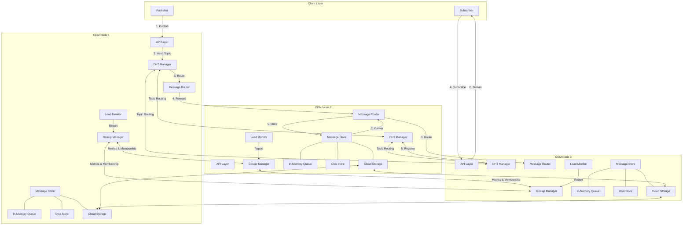

In-Depth Architecture
Core Components
1. Node Layer
Each GEM node is autonomous and contains:
Gossip Manager: Maintains cluster membership and health metrics
DHT Manager: Implements distributed hash table for topic routing
Message Store: Multi-tiered storage for messages
API Layer: Exposes pub/sub endpoints
Message Router: Routes messages to appropriate nodes based on topic hash
Load Monitor: Tracks CPU, memory, queue depth, and network usage
2. Storage Layer
In-Memory Queue: Primary storage for hot messages
Embedded KV Store: Secondary storage using RocksDB/LevelDB
Cloud Storage: Tertiary storage for cold messages and durability
3. Routing Mechanism
Topic Hashing: SHA-256(topic) determines topic ownership
Consistent Hashing Ring: Places nodes in a virtual ring
Replica Management: Maintains N replicas for each topic
Load Balancing: Dynamic topic ownership based on node load
4. Client API
Publisher API: Simple REST/gRPC for message production
Subscriber API: Long-polling/WebSocket for message consumption
Admin API: Configuration and monitoring
Data Flow
Publishing Flow:
Client sends message to any GEM node
Node computes topic hash
DHT determines responsible node(s)
Message routes to responsible node(s)
Message stored in memory/disk
ACK returned to publisher
Subscription Flow:
Client registers subscription with any node
Node registers subscriber in distributed registry
Topic owner nodes deliver messages to subscriber
Subscriber sends ACKs for processed messages
Storage Flow:
New messages stored in memory queue
Messages shift to disk when memory threshold reached
Messages move to cloud storage based on age/access patterns
Indexes maintained for fast retrieval

Key Technical Innovations
Self-Healing Mechanism:
Nodes detect failures through gossip protocol
Topic ownership automatically transfers to healthy nodes
Messages replicated across N nodes for resilience
Dynamic Load Balancing:
Nodes share load metrics via gossip
Overloaded nodes transfer topic ownership
New nodes gradually take ownership of topics
Tiered Storage:
Hot messages stay in memory for fast access
Warm messages move to local disk
Cold messages archive to cloud storage
Message access patterns determine tier placement
AI-Powered Scaling:
Collects historical traffic patterns
Predicts upcoming load spikes
Triggers proactive scaling of node count
Rebalances topic ownership before congestion occurs