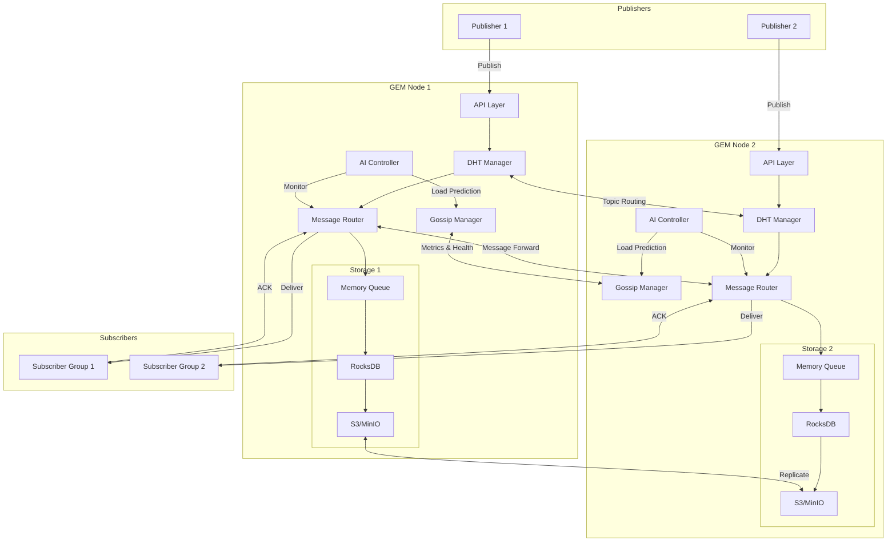

# Sprawl Architecture Design

## Core Components

### 1. Node Layer
Each Sprawl node consists of:
- **P2P Overlay**
  - Gossip Protocol Manager (membership, metrics sharing)
  - DHT Manager (topic routing, node mapping)
- **Message Processing**
  - Message Router (topic-based routing)
  - ACK Tracker (delivery confirmation)
  - Retry Manager (failed delivery handling)
- **Storage Engine**
  - Memory Queue Manager
  - Disk Storage Manager (RocksDB)
  - Cloud Storage Manager (S3/MinIO)
- **Intelligence Layer**
  - Load Monitor
  - AI Prediction Engine
  - Auto-scaling Controller

### 2. Message Flow
- **Publishing Pipeline**
  1. Message receipt and validation
  2. Topic hash computation
  3. DHT-based route resolution
  4. Load-balanced forwarding
  5. Storage and replication
  6. Publisher acknowledgment

- **Subscription Pipeline**
  1. Subscriber registration
  2. Health monitoring
  3. Message delivery
  4. ACK processing
  5. Retry handling
  6. Backpressure management

### 3. Storage Architecture
- **Memory Layer**
  - Hot message queue
  - Routing cache
  - Metric buffers
- **Disk Layer**
  - RocksDB for persistence
  - Message index
  - Subscriber state
- **Cloud Layer**
  - Cold message archive
  - Backup storage
  - Cross-region replication

### 4. Intelligence Systems
- **Load Prediction**
  - Traffic pattern analysis
  - Resource usage forecasting
  - Scaling recommendations
- **Route Optimization**
  - Dynamic path selection
  - Congestion avoidance
  - Load distribution

### 5. Operational Features
- **Monitoring**
  - Performance metrics
  - Health checks
  - Alert triggers
- **Management**
  - Node administration
  - Topic management
  - Subscriber control
- **Security**
  - TLS encryption
  - Authentication
  - Authorization

## Data Flows

### Publishing Pipeline
1. Client publishes to any node
2. Node computes topic hash
3. DHT resolves owner node(s)
4. Message routes to owner(s)
5. Storage confirmation
6. Publisher receives ACK

### Subscription Pipeline
1. Client subscribes via any node
2. Subscription recorded in registry
3. Owner nodes stream messages
4. Client confirms processing

### Storage Pipeline
1. Initial memory queue storage
2. Disk transition at memory threshold
3. Cloud archival based on policies
4. Index maintenance for retrieval

## Technical Innovations

### Self-Healing
- Gossip-based failure detection
- Automatic topic redistribution
- N-way message replication

### Load Balancing
- Gossip-propagated metrics
- Dynamic topic redistribution
- Gradual new node integration

### Storage Management
- Memory-first for hot data
- Disk for warm data
- Cloud for cold storage
- Access-pattern-based placement

### AI Operations
- Traffic pattern analysis
- Load prediction
- Proactive scaling
- Preventive rebalancing
